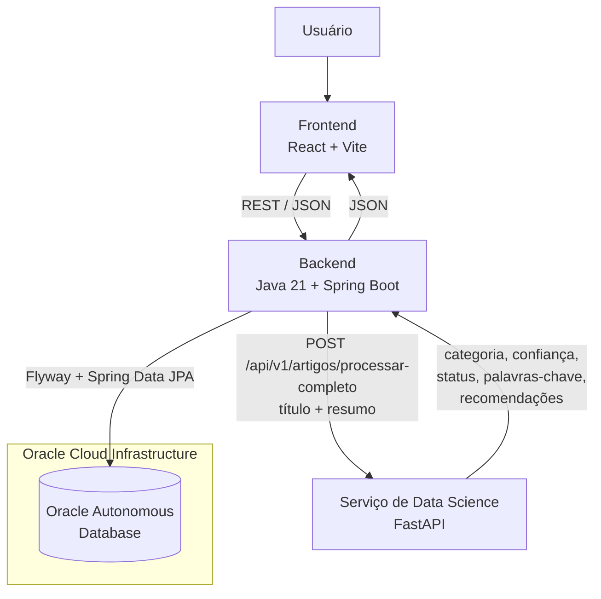

# TechMind

Plataforma que classifica automaticamente conteúdos técnicos por área de conhecimento, extrai palavras-chave e recomenda materiais relacionados — com moderação humana para os casos de baixa confiança.

Projeto desenvolvido durante o Hackathon do programa ONE (Oracle Next Education), em parceria entre Oracle e Alura.

## Sobre o projeto

Equipes técnicas acumulam artigos, notas e materiais de estudo sem uma forma consistente de organizá-los por assunto. Classificar isso manualmente não escala, e confiar 100% em um modelo de IA sem nenhuma revisão humana traz risco de erro silencioso.

O TechMind resolve isso combinando três peças: um modelo de Ciência de Dados que classifica o conteúdo, sugere palavras-chave e recomenda materiais semelhantes; um backend que aplica regras de negócio e persiste o resultado; e um fluxo de moderação humana que intercepta exatamente os casos em que o modelo teve baixa confiança, permitindo aprovar, rejeitar ou corrigir a categoria antes de o conteúdo ser considerado definitivo.

## Arquitetura



O diagrama reflete o que está implementado no código, não uma arquitetura conceitual: o backend nunca recalcula a decisão da IA — ele usa exatamente a categoria, a confiança e o status que o serviço de Data Science retorna, sem aplicar nenhum limiar próprio. O serviço de Data Science nunca grava diretamente no Oracle — toda persistência passa pelo backend.

### Fluxo de processamento

1. O usuário cadastra um conteúdo (título + texto) no frontend.
2. O backend normaliza o texto (remove quebras de linha e espaços duplicados) e envia `titulo` + `resumo` ao serviço de Data Science.
3. O serviço de Data Science classifica o texto, extrai palavras-chave e busca conteúdos semelhantes; decide `APROVADO` ou `PENDENTE_MODERACAO` a partir de um limiar de confiança.
4. O backend persiste o resultado tal como recebido (Oracle ou H2, conforme o perfil ativo) e devolve a resposta ao frontend.
5. Se o status vier como `PENDENTE_MODERACAO`, o conteúdo aparece na tela de detalhes com as ações de moderação (aprovar, rejeitar, corrigir categoria); a decisão humana fica registrada em um histórico de feedback.

## Backend

Java 21 + Spring Boot 3.5.3 (Maven). Responsabilidades confirmadas no código:

- Validação de entrada e normalização de texto antes de chamar a IA.
- Orquestração da chamada ao serviço de Data Science, com timeout configurável e sem fallback silencioso (indisponibilidade do serviço vira HTTP 502).
- Persistência via Spring Data JPA, com paginação e filtros resolvidos direto no banco (Specifications), sem carregar tudo em memória.
- Regras de moderação: só permite decisão humana sobre conteúdos `PENDENTE_MODERACAO`, registra a categoria original da IA separadamente da categoria corrigida, e mantém histórico de cada decisão.
- Versionamento de schema com Flyway (migrations próprias para H2 e para Oracle).
- Documentação da API via springdoc-openapi (Swagger UI).

## Frontend

React 19 + Vite 6, aplicação de página única (sem rotas). Telas e funcionalidades confirmadas em `App.jsx`:

- Dashboard com métricas globais (total, aprovados, pendentes, rejeitados, categorias distintas, confiança média e distribuição por categoria).
- Formulário de classificação com painel de resultado (categoria, confiança, palavras-chave, conteúdos relacionados com score de similaridade).
- Listagem paginada com filtros por título, categoria, status e palavra-chave.
- Painel de detalhes com edição de conteúdo, exclusão (com confirmação), painel de moderação (aprovar/rejeitar/corrigir categoria) e histórico de feedback de moderação.
- Indicador de disponibilidade da API, estados de carregamento e mensagens de erro específicas por seção.

A comunicação com o backend é feita via `fetch` (`frontend/src/api/artigosApi.js`); em desenvolvimento, o Vite faz proxy de `/api` para o backend local, evitando problemas de CORS.

## Data Science

Serviço em Python/FastAPI (`techmind-ai-service/`), mantido pela equipe de Ciência de Dados. Responsabilidades confirmadas em `main.py`:

- **Classificação**: pipeline TF-IDF + LinearSVC calibrado (`classificador_techmind.pkl`), com limiar de confiança configurável (`config_classificador.json`; 0,60 por padrão no código) que decide `APROVADO` ou `PENDENTE_MODERACAO`.
- **Palavras-chave**: extração via KeyBERT sobre o texto combinado de título e resumo.
- **Recomendação**: os 3 conteúdos mais similares, calculados por similaridade de cosseno entre embeddings gerados com SentenceTransformer (`all-MiniLM-L6-v2`) e uma base pré-computada (`embeddings_techmind.npy` + `artigos_com_embeddings.json`).
- **Sanitização de texto**: o próprio serviço remove quebras de linha e espaços duplicados antes de processar — o backend Java faz a mesma normalização antes de enviar, como camada extra de proteção.
- **Retreinamento**: existe um endpoint (`POST /api/v1/modelo/retreinar`), mas ele apenas dispara uma tarefa em background que registra a intenção em log — não há lógica de retreinamento implementada, e o backend nunca chama esse endpoint. Não é uma funcionalidade entregue, apenas um placeholder no serviço de IA.

**Divergência confirmada entre o repositório e o serviço validado nos testes:**

- **Versão presente neste repositório** (`techmind-ai-service/main.py`): devolve o campo `confianca` no JSON de resposta e não expõe nenhum endpoint `/health`.
- **Versão utilizada na validação ponta a ponta** (executada localmente, fora deste repositório): respondeu ao contrato com o campo `probabilidade` e respondeu com sucesso a `GET /health` → `{"status":"healthy","service":"techmind-ai-service","model_loaded":true}`.

O backend Java foi implementado para o contrato oficial (`probabilidade`) e expõe esse mesmo valor ao frontend através do seu próprio DTO de resposta, onde ele aparece como `confianca` — são dois contratos distintos (externo IA↔Backend e interno Backend↔Frontend) para o mesmo dado, não uma renomeação acidental. A divergência entre o `main.py` versionado e o serviço realmente validado é registrada aqui como observação técnica; nenhum arquivo da equipe de Data Science foi alterado para investigar ou corrigi-la — o backend sempre consome esse serviço exclusivamente via HTTP.

**Docker:** este repositório tem dois `Dockerfile` — `backend/Dockerfile` (empacota o backend Java) e `backend/ml-service/Dockerfile` (empacota um sidecar Python local simplificado, usado só em desenvolvimento). O `docker-compose.yml` sobe apenas esses dois serviços; ele reaproveita o arquivo do modelo (`classificador_techmind.pkl`) via volume, mas **não** sobe o serviço real de Data Science — `techmind-ai-service/` não tem `Dockerfile` neste repositório, e o contrato de resposta do sidecar local não inclui os campos `status` nem `probabilidade`. Ou seja, `docker compose up` não equivale a rodar a stack completa validada com o serviço real de IA.

## Banco de dados

Oracle Autonomous Database, via perfil Spring `oci` — schema versionado com Flyway (criação das tabelas, ajuste de tipo da probabilidade, e adição das tabelas de moderação/feedback). No perfil padrão (`local`), a mesma estrutura roda em H2 em memória, permitindo desenvolver e testar sem depender da OCI.

Tabelas principais: `artigos_classificados` (conteúdo e resultado da classificação), `artigos_informacoes` (palavras-chave, coleção associada) e `artigos_feedback` (histórico de decisões de moderação).

## Oracle Cloud Infrastructure

| Recurso | Status |
|---|---|
| Oracle Autonomous Database (região `sa-saopaulo-1`) | ✅ Operacional — integrado e validado com o backend |
| Aplicação completa (backend + frontend + Data Science + Oracle) | ✅ Validada localmente, ponta a ponta, contra o serviço real de Data Science e o Autonomous Database |
| VM `VM.Standard.E2.1.Micro` (Always Free) | ✅ Provisionada e acessível via SSH |
| VM `VM.Standard.A1.Flex` (1 OCPU / 6 GB, Always Free, ARM) | ⏳ Pendente — a OCI retorna indisponibilidade de capacidade ("Out of host capacity") na região `sa-saopaulo-1` |

A VM `E2.1.Micro` já provisionada tem recursos insuficientes (1 GB de RAM) para hospedar o serviço de Data Science completo (modelos de embeddings e KeyBERT são pesados em memória). Por isso, o deploy completo depende da `A1.Flex`, e existe uma automação via OCI CLI + PowerShell que tenta periodicamente provisioná-la. A indisponibilidade de capacidade é uma limitação momentânea da região na conta Always Free da OCI, não um erro de configuração do projeto.

Por segurança, este README não expõe OCIDs, endereços IP, tenancy, usuário OCI, fingerprints, chaves SSH, wallet ou senhas — essas informações ficam apenas em configuração local/externa.

## Principais funcionalidades

- Cadastro e classificação automática de conteúdo técnico
- Categoria, confiança, palavras-chave e conteúdos relacionados (com score de similaridade)
- Listagem paginada com filtros combináveis (título, categoria, status, palavra-chave)
- Dashboard com estatísticas globais e distribuição por categoria
- Moderação humana (aprovação, rejeição e correção manual de categoria) para conteúdos de baixa confiança
- Histórico de decisões de moderação por conteúdo
- Edição e exclusão de conteúdo
- Persistência em Oracle Autonomous Database (produção) ou H2 (desenvolvimento)
- Estados de carregamento e mensagens de erro específicas por ação

## Tecnologias

| Camada | Tecnologias |
|---|---|
| Frontend | React 19, Vite 6 |
| Backend | Java 21, Spring Boot 3.5.3, Maven, Spring Data JPA, Flyway, springdoc-openapi |
| Data Science | Python, FastAPI, scikit-learn, KeyBERT, Sentence-Transformers, pandas, numpy |
| Banco | Oracle Autonomous Database, H2 (desenvolvimento) |
| Cloud | Oracle Cloud Infrastructure (Autonomous Database + Compute) |
| Testes | JUnit 5, Mockito, Spring Boot Test |
| DevOps | Docker, Docker Compose (backend + sidecar local de desenvolvimento) |

## Estrutura do projeto

```
TechMind/
├── backend/                   # API Java 21 + Spring Boot
│   ├── src/main/java/...      # controllers, services, repositories, entidades, DTOs
│   ├── src/main/resources/    # application.yml, migrations Flyway (h2/ e oracle/)
│   ├── src/test/java/...      # testes JUnit e Mockito
│   └── ml-service/            # sidecar Python local para desenvolvimento (mock)
├── frontend/                  # SPA React + Vite
│   └── src/
├── techmind-ai-service/       # serviço de Data Science (FastAPI) da equipe de ML
│   └── models/                 # artefatos do modelo (.pkl, .npy, .json)
├── docs/
└── README.md
```

## Como executar localmente

### Pré-requisitos

- Java 21 e Maven
- Node.js 18+ e npm
- Python 3.x (somente se for executar o serviço de Data Science localmente)
- Oracle wallet (somente para usar o perfil `oci` — opcional; sem ele, o projeto roda inteiro em H2)

### Data Science

A versão atualmente presente neste repositório não documenta um comando oficial de inicialização deste serviço (não há `Dockerfile`, script ou README próprio em `techmind-ai-service/`). Para executá-lo localmente, é necessário confirmar o comando com a equipe de Ciência de Dados.

### Backend

```bash
cd backend
mvn spring-boot:run
```

Por padrão (perfil `local`), a aplicação usa H2 em memória e um classificador mock embutido — não é necessário nenhum serviço externo para subir o backend. Para consumir o serviço real de Data Science, defina `ML_SERVICE_MOCK_ENABLED=false` e `ML_SERVICE_URL` apontando para ele antes de rodar.

### Frontend

```bash
cd frontend
npm install
npm run dev
```

Com backend (8080) e frontend (5173) no ar, acesse o endereço exibido pelo Vite. O serviço de Data Science, quando disponível, roda por padrão na porta 8000 — todas as portas são configuráveis por variável de ambiente.

## Variáveis de ambiente

Apenas os nomes — nunca valores reais devem ser commitados.

**Backend** (ver `backend/.env.example`):

```
SERVER_PORT=
DB_URL=
DB_USERNAME=
DB_PASSWORD=
CORS_ALLOWED_ORIGINS=
ML_SERVICE_URL=
ML_SERVICE_MOCK_ENABLED=
ML_SERVICE_CONNECT_TIMEOUT_MS=
ML_SERVICE_READ_TIMEOUT_MS=
OCI_DATABASE_ENABLED=
OCI_DATABASE_URL=
OCI_DATABASE_USERNAME=
OCI_DATABASE_PASSWORD=
OCI_WALLET_PATH=
```

**Frontend** (ver `frontend/.env.example`):

```
VITE_API_URL=
VITE_SWAGGER_URL=
```

## API

Endpoints do backend (`/api/artigos`):

| Método | Endpoint | Descrição |
|---|---|---|
| POST | `/api/artigos/classificar` | Classifica um conteúdo e persiste o resultado |
| GET | `/api/artigos` | Lista paginada, com filtros por título, categoria, status e palavra-chave |
| GET | `/api/artigos/{id}` | Detalhe de um conteúdo |
| PUT | `/api/artigos/{id}` | Edita título, texto, autores, link e ano (não reclassifica) |
| DELETE | `/api/artigos/{id}` | Exclui um conteúdo |
| PATCH | `/api/artigos/{id}/moderacao` | Aplica decisão humana de moderação (somente para `PENDENTE_MODERACAO`) |
| GET | `/api/artigos/{id}/feedback` | Histórico de decisões de moderação de um conteúdo |
| GET | `/api/artigos/estatisticas` | Estatísticas globais para o dashboard |
| GET | `/api/artigos/health` | Health check do backend |

Endpoints do serviço de Data Science consumidos pelo backend:

| Método | Endpoint | Descrição |
|---|---|---|
| POST | `/api/v1/artigos/processar-completo` | Classificação + palavras-chave + recomendação |
| POST | `/api/v1/modelo/retreinar` | Placeholder de retreinamento — não é chamado pelo backend (ver seção Data Science) |

Documentação interativa completa (Swagger) disponível em `/swagger-ui.html` com o backend em execução.

## Testes

Backend: JUnit 5 + Mockito + Spring Boot Test, cobrindo camada web (`ArtigoControllerTest`), regras de negócio (`ArtigoServiceTest`), integração com o serviço de ML mockado (`PredicaoClientTest`, `ArtigoIntegracaoTest`) e filtros/paginação no banco (`ArtigoRepositorySpecificationTest`).

```bash
cd backend
mvn clean test
```

```bash
cd frontend
npm run build
```

**Última regressão registrada** (validada antes do commit `710c14a`, não uma nova execução feita para este README):

- `mvn clean test` → `BUILD SUCCESS`, 68 testes, 0 falhas, 0 erros
- `npm run build` → sucesso

## Status do projeto

| Item | Status |
|---|---|
| Cadastro, classificação, filtros, dashboard | ✅ Implementado |
| Moderação humana, correção de categoria, histórico de feedback | ✅ Implementado |
| Edição e exclusão de conteúdo | ✅ Implementado |
| Persistência em Oracle Autonomous Database | ✅ Implementado e validado |
| Integração real com o serviço de Data Science | ✅ Validada localmente |
| Retreinamento do modelo de IA | 🟡 Placeholder no serviço de Data Science, sem lógica real nem integração com o backend |
| Deploy completo em VM `A1.Flex` na OCI | ⏳ Dependência externa — indisponibilidade de capacidade Always Free ARM em `sa-saopaulo-1` |

## Segurança

Credenciais, senhas, wallets e chaves nunca são commitadas — toda configuração sensível é fornecida via variáveis de ambiente (ver seção acima) ou arquivos locais explicitamente listados no `.gitignore` (`.env`, `wallet/`, `*.pem`, `*.jks`, `*.sso`, `tnsnames.ora`, `sqlnet.ora`, entre outros). Este README foi revisado para não conter nenhum segredo, OCID, IP ou credencial.

## Equipe

Seção reservada para preenchimento posterior pela equipe.

## Licença

Este repositório não possui um arquivo `LICENSE` até o momento.
